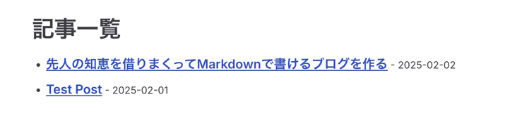
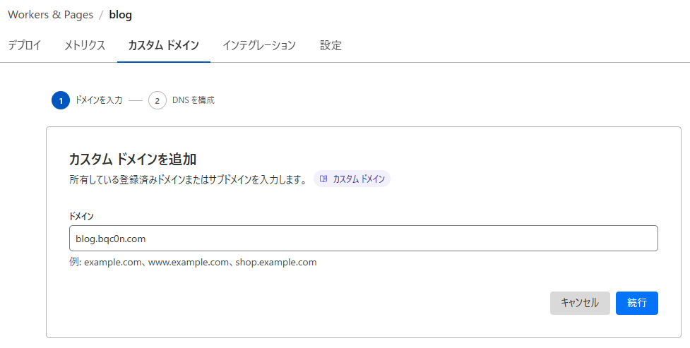

# 先人の知恵を借りまくってMarkdownで書けるブログを作る

先人たちの知恵[^r1][^r2]を大いに借りながら、このブログを作成し、Cloudflare Pagesにデプロイした時の作業記録。
ソースコードは[Github](https://github.com/bqc0n/blog)にもあるので、細かいところはそちらを。

[[toc]]

## 参考にしたサイト様

- [ブログサイトを VitePress へ移行した](https://nshmura.com/posts/migration-to-vitepress/) - nshmura.com
- [VitePressでブログを作ってみました](https://blog.hakuteialpha.com/posts/vitepress-blog/) - blog.hakuteialpha.com

## VitePressの準備

[Getting Started](https://vitepress.dev/guide/getting-started)に沿ってVitePressをセットアップする。

```shell
bun install -D vitepress
```

VitePressの初期設定をする。configやmdファイルなどを置く場所は`./docs`にして、TitleとDescriptionは適当、他はデフォルトにした。

```shell
bun vitepress init
```

## ディレクトリ構成
`posts/<year>`の下に、`<MMDD-title>.md`というフォーマットでファイルを作って記事を書くことにする。
```
.
├── docs
│   ├── posts
│   │   ├── <year>
│   │   │   ├── <MMDD-title>.md
│   │   │   └── ...
```

## Tailwind CSSを入れる

Tailwind CSSを使いたいので入れる。
どうやら最近(2025-1-22)にv4.0.0が出たようで、インストール体系が変わったぽい。
Web初心者には難しかったので今回はv3系を使う。時間があるときに勉強してv4にしようかな。

```shell
bun install -D tailwindcss@3.4.17 autoprefixer postcss
```

次に各種設定ファイルを書く。

::: code-group

```js [postcss.config.js]
module.exports = {
    plugins: {
        tailwindcss: {},
        autoprefixer: {},
    },
}
```

```js [tailwind.config.js]
export default {
    content: [
        './docs/index.md',
        './docs/**/*.md',
        './.vitepress/**/*.{js,ts,vue}'
    ],
    theme: {
        extend: {},
    },
    plugins: [],
    important: true,
}
```

:::

::: code-group

```css [.vitepress/theme/custom.css]
@tailwind base;
@tailwind components;
@tailwind utilities;
```

```ts [.vitepress/theme/index.ts]
import DefaultTheme from 'vitepress/theme'
import './custom.css'

export default DefaultTheme
```

:::

これでTailwind CSSの導入はおわり。

## Markdown-it の Pluginを入れる

VitePressはMarkdown-it使っている[^vmit]ので、色々なプラグインを入れて機能拡張できる。

### Footnote[^markdown-it-footnote]

```sh
bun install -D markdown-it-footnote 
```

`config.mts`に以下を追記

```ts 
import markdownItFootnote from 'markdown-it-footnote' // [!code ++]

export default defineConfig({
    markdown: { // [!code ++]
        config: (md) => { // [!code ++]
            md.use(markdownItFootnote) // [!code ++]
        } // [!code ++]
    }, // [!code ++]
}
```

### Vitepress Plugin Group Icons[^vpgi]

`::: code-group`にアイコンをつけたり、`::: code-group`以外でもCode BlockにTitle Barをつけたりできる。

```shell
bun install -D vitepress-plugin-group-icons
```

このプラグインは、importして`md.use`する以外にもviteの設定やthemeの`index.ts`への追記が必要。

::: code-group

```ts [.vitepress/config.mts]
import {groupIconMdPlugin, groupIconVitePlugin} from 'vitepress-plugin-group-icons' // [!code ++]

export default defineConfig({
    markdown: {
        config: (md) => {
            md.use(groupIconMdPlugin) // [!code ++]
        }
    },


    vite: { // [!code ++]
        plugins: [ // [!code ++]
            groupIconVitePlugin()  // [!code ++]
        ] // [!code ++]
    }, // [!code ++]
}
```

```ts [.vitepress/theme/index.ts]
import 'virtual:group-icons.css' // [!code ++]
```

:::

## `config.mts`で追加の設定

- `lastUpdated: true`: ページの下にちっちゃく最終更新日が表示される
- `cleanUrls: true`: URL末尾の`.html`が消える。デプロイ先によっては追加の設定が必要かもしれないが、今回はそのままで動いてくれた。

## トップページの作成

トップページには記事一覧を表示したいので、まず記事一覧を取得するために[Build-Time Data Loading](https://vitepress.dev/guide/data-loading)という機能を利用する。

```ts [.vitepress/posts.data.mts]
import { createContentLoader } from 'vitepress';

export default createContentLoader('posts/*/*.md', {
    includeSrc: false,
    transform(rawData) {
        return rawData
            .filter(page => page.url != "/posts/")
            .sort((a, b) => { return +new Date(b.frontmatter.date) - +new Date(a.frontmatter.date) })
    }
});
```

また`custom.css`に以下を追記。
```shell
.home-posts-article {
    border-top: 1px solid var(--vp-c-divider);
    padding: 10px 0;
}
```

momentをインストール。
```shell
bun install -D moment
```

トップページを作成する。
```md
---
title: Home
layout: doc
next: false
prev: false
---

<script setup>
import { data as posts } from '.vitepress/posts.data.mts';
import moment from 'moment';
</script>

# blog.bqc0n.com

個人的な備忘録集です。記事の内容は、[MIT-License](https://github.com/bqc0n/blog/blob/main/LICENSE)で利用可能です。

<article v-for="post of posts" class="home-posts-article">
  <a :href="post.url" class="block text-inherit no-underline hover:underline">
    <p class="text-2xl">{{ post.frontmatter.title }}</p>
    <p class="text-sm text-gray-500">{{ moment(post.frontmatter.date).format('YYYY-MM-DD') }}</p>
    <p>{{ post.frontmatter.description }}</p>
  </a>   
</article>
```

## 記事一覧ページの作成
トップページと同じように記事一覧ページも作る。

```md
---
title: Posts | blog.bqc0n.com
layout: doc
next: false
prev: false
---
<script lang="ts" setup>
import { data as posts } from "../.vitepress/posts.data"
import moment from 'moment';
</script>

# 記事一覧ページの作成

<ul>
    <li v-for="post of posts">
        <a :href="post.url" class="font-semibold text-lg">{{ post.frontmatter.title }}</a>
        <span class="text-sm"> - {{ moment(post.frontmatter.date).format('YYYY-MM-DD') }}</span>
    </li>
</ul>
```
こんな感じになる。


## タグページの作成

[Dynamic Routes](https://vitepress.dev/guide/routing#dynamic-routes)を使って、build時にタグページを動的に作成するようにする。

Dynamic Routesは、`[placeholder].md`のように`[]`を名前に含むファイルやディレクトリを作ることで、
`placeholder`に文字列を代入して動的にページを作成できる機能である。

ディレクトリ構造はこのようにする。
```
 docs
└──  tags
    ├──  [tag]
    │   ├──  index.md
    │   └──  index.paths.js
    └──  index.md
```

次にplaceholderに代入される文字列を作成する Paths Loader File を作成する。
`tag:`が`[tag]`に代入される文字列である。`content:`はmdファイルの`<!-- @content -->`に展開される文字列で、これを利用して
ページの内容を動的に変化させることができる。
```js 
import fs from 'fs'
import { globSync } from 'glob'

var tags = {}

var files = globSync("docs/posts/**/*.md");

files.forEach(file => {
    var data = fs.readFileSync(file, 'utf8');
    var found = data.match(/^tags:\s*\[(.+)]\s*$/m)
    if (found) {
        found[1].split(",")
            .map(tag => tag.replaceAll('"', '') )
            .forEach(tag => tags[tag.replaceAll(' ', '')] = tag )
    }
});

export default {
    paths: () => {
        return Object.keys(tags).map((key) => {
            return { params: { tag: key }, content: `# タグ: ${tags[key]}`}
        })
    }
}
```

`[tag]/index.md`も作成
```md
---
next: false
prev: false
---

<script setup>
import { useData } from 'vitepress'
import { data as posts } from '../../.vitepress/posts.data.mts'

const { params } = useData()
const current_tag = params.value.tag

var pages = []
posts.forEach(post => {
    if (post.frontmatter.tags){
        var tags = post.frontmatter.tags.map(tag => tag.replaceAll(" ", "") )
        if (tags.includes(current_tag)) pages.push(post) 
    }
})

</script>

<!-- @content -->

<ul>
  <li v-for="page of pages">
    <a :href="page.url">{{ page.frontmatter.title }}</a>
  </li>
</ul>
```
これでタグページの作成も完了。

## デプロイ
ここまで出来たら、いよいよCloudflare Pagesにデプロイする。

::: info
Cloudflare Dashboardの仕様はよく変わるので、その時は都度読み替えてください。
:::

GitHubとの連携は済ませてある前提とする。

[Cloudflare Dashboard](https://dash.cloudflare.com/)から、Workersを選択して、右上の作成ボタンをクリック。

blogのリポジトリを選択すると、様々な項目を入力する画面に遷移するので、プロジェクト名とブランチを適切に設定する。
またビルドコマンドには`bun run docs:build`、デプロイコマンドには`bunx wrangler deploy --assets ./docs/.vitepress/dist/ --name blog --compatibility-date 2025-02-04`を設定する。


次にカスタムドメインの設定をする。
Pagesからblogの詳細ページに行ったら、設定タブに移動する。

右上の追加を押して、カスタムドメインを選択して設定する。


以上でデプロイ完了で、ブログ完成。

## TODO
- 投稿日と最終更新日、ついているタグを記事の最初に表示する
- [VitePress Plugin Git Changelog](https://nolebase-integrations.ayaka.io/pages/en/integrations/vitepress-plugin-git-changelog/)を入れる
- コメントできるようにする([vitepress-plugin-comment-with-giscus](https://github.com/T-miracle/vitepress-plugin-comment-with-giscus))

[^r1]: https://nshmura.com/posts/migration-to-vitepress/
[^r2]: https://blog.hakuteialpha.com/posts/vitepress-blog/
[^vmit]: https://vitepress.dev/guide/markdown#advanced-configuration
[^vpgi]: https://vpgi.vercel.app
[^markdown-it-footnote]: https://github.com/markdown-it/markdown-it-footnote