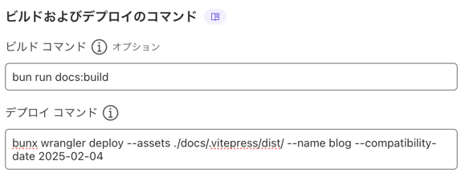
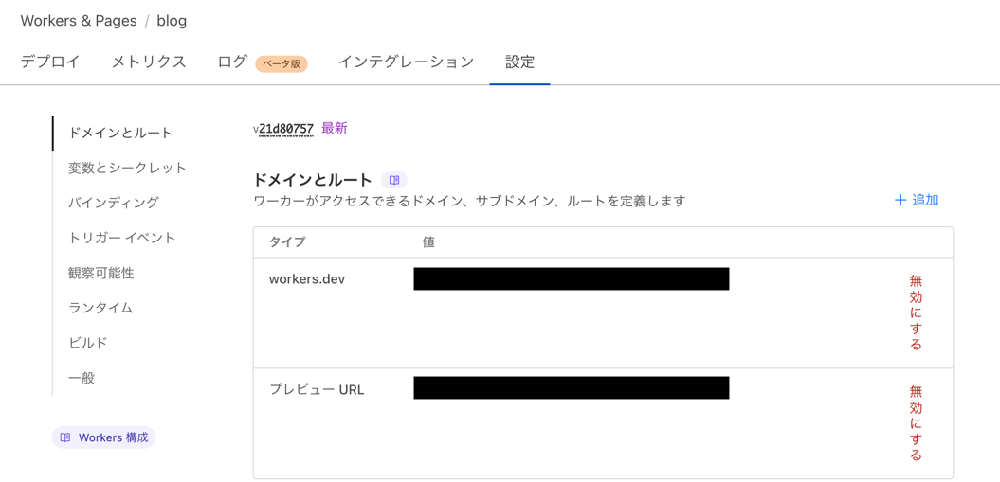
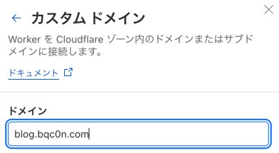

---

先人たちの知恵[^r1][^r2]を大いに借りながら、このブログを作成し、Cloudflare Pagesにデプロイした時の作業記録。
といいつつ作って後から書いたので、抜けがあるかも。

ソースコードは[Github](https://github.com/bqc0n/blog)にもあるので、細かいところはそちらを。

[[toc]]

## 参考にしたサイト様

- [ブログサイトを VitePress へ移行した](https://nshmura.com/posts/migration-to-vitepress/) - nshmura.com
- [VitePressでブログを作ってみました](https://blog.hakuteialpha.com/posts/vitepress-blog/) - blog.hakuteialpha.com

## VitePressの準備

[Getting Started](https://vitepress.dev/guide/getting-started)に沿ってVitePressをセットアップする。

```shell
bun install -D vitepress
```

VitePressの初期設定をする。configやmdファイルなどを置く場所は`./docs`にして、TitleとDescriptionは適当、他はデフォルトにした。

```shell
bun vitepress init
```

## ディレクトリ構成
`posts/<year>`の下に、`<MMDD-title>.md`というフォーマットでファイルを作って記事を書くことにする。
```
.
├── docs
│   ├── posts
│   │   ├── <year>
│   │   │   ├── <MMDD-title>.md
│   │   │   └── ...
```

## Tailwind CSSを入れる

Tailwind CSSを使いたいので入れる。
どうやら最近(2025-1-22)にv4.0.0が出たようで、インストール体系が変わったぽい。
Web初心者には難しかったので今回はv3系を使う。時間があるときに勉強してv4にしようかな。

```shell
bun install -D tailwindcss@3.4.17 autoprefixer postcss
```

次に各種設定ファイルを書く。

::: code-group

```js [postcss.config.js]
module.exports = {
    plugins: {
        tailwindcss: {},
        autoprefixer: {},
    },
}
```

```js [tailwind.config.js]
export default {
    content: [
        './docs/index.md',
        './docs/**/*.md',
        './.vitepress/**/*.{js,ts,vue}'
    ],
    theme: {
        extend: {},
    },
    plugins: [],
    important: true,
}
```

:::

::: code-group

```css [.vitepress/theme/custom.css]
@tailwind base;
@tailwind components;
@tailwind utilities;
```

```ts [.vitepress/theme/index.ts]
import DefaultTheme from 'vitepress/theme'
import './custom.css'

export default DefaultTheme
```

:::

これでTailwind CSSの導入はおわり。

## Markdown-it の Pluginを入れる

VitePressはMarkdown-it使っている[^vmit]ので、色々なプラグインを入れて機能拡張できる。

### Footnote[^markdown-it-footnote]

```sh
bun install -D markdown-it-footnote 
```

`config.mts`に以下を追記

```ts 
import markdownItFootnote from 'markdown-it-footnote' // [!code ++]

export default defineConfig({
    markdown: { // [!code ++]
        config: (md) => { // [!code ++]
            md.use(markdownItFootnote) // [!code ++]
        } // [!code ++]
    }, // [!code ++]
})
```

### Vitepress Plugin Group Icons[^vpgi]

`::: code-group`にアイコンをつけたり、`::: code-group`以外でもCode BlockにTitle Barをつけたりできる。

```shell
bun install -D vitepress-plugin-group-icons
```

このプラグインは、importして`md.use`する以外にもviteの設定やthemeの`index.ts`への追記が必要。

::: code-group

```ts [.vitepress/config.mts]
import {groupIconMdPlugin, groupIconVitePlugin} from 'vitepress-plugin-group-icons' // [!code ++]

export default defineConfig({
    markdown: {
        config: (md) => {
            md.use(groupIconMdPlugin) // [!code ++]
        }
    },


    vite: { // [!code ++]
        plugins: [ // [!code ++]
            groupIconVitePlugin()  // [!code ++]
        ] // [!code ++]
    }, // [!code ++]
})
```

```ts [.vitepress/theme/index.ts]
import 'virtual:group-icons.css' // [!code ++]
```

:::

## VitePressのPlugin達を入れる

### Git-based page histories

https://nolebase-integrations.ayaka.io/pages/en/integrations/vitepress-plugin-git-changelog/configure-vite-plugins

VitePressのConfigとthemeのconfig両方をいじる必要がある。

自分で使う場合は、`mapAuthors`のそれぞれの項目を変更すると良い。
GitHubの場合、アイコンの生URLはプロファイルページのアイコン画像から取得できるはず。
その他それぞれの設定の意味などは[Pluginの公式Document](https://nolebase-integrations.ayaka.io/pages/en/integrations/vitepress-plugin-git-changelog/configure-vite-plugins)を参照。

```shell
bun install -D @nolebase/vitepress-plugin-git-changelog
```

::: code-group

```ts [.vitepress/config.mts]
import { GitChangelog, GitChangelogMarkdownSection } from '@nolebase/vitepress-plugin-git-changelog/vite' // [!code ++]

export default defineConfig({
    vite: {
        plugins: [
            GitChangelog({ // [!code ++]
                repoURL: () => "https://github.com/bqc0n/blog", // [!code ++]
                mapAuthors: [{ // [!code ++]
                    avatar: "https://avatars.githubusercontent.com/u/89625049?v=4", // [!code ++]
                    name: "bqc0n", username: "bqc0n", // [!code ++]
                    mapByNameAliases: ["bqc0n"], // [!code ++]
                }] // [!code ++]
            }), // [!code ++]
            GitChangelogMarkdownSection({ // [!code ++]
                exclude: (id) => id.endsWith('index.md'), // [!code ++]
            }), // [!code ++]
        ],
    },
})
```

```ts [.vitepress/theme/index.ts]
import DefaultTheme from 'vitepress/theme'
import './custom.css'
import 'virtual:group-icons.css'
import { NolebaseGitChangelogPlugin } from "@nolebase/vitepress-plugin-git-changelog/client" // [!code ++]
import '@nolebase/vitepress-plugin-git-changelog/client/style.css' // [!code ++]

export default DefaultTheme // [!code --]
export default { // [!code ++]
    ...DefaultTheme, // [!code ++]
    enhanceApp({app}) { // [!code ++]
        app.use(NolebaseGitChangelogPlugin) // [!code ++]
    } // [!code ++]
} // [!code ++]
```

:::

### vitepress-plugin-lightbox

https://github.com/BadgerHobbs/vitepress-plugin-lightbox

```shell
bun install -D vitepress-plugin-lightbox
```

画像をクリックしたら拡大するやつ。

`config.mts`と`theme/index.ts`への追記、`theme/Layout.vue`の作成が必要。

::: code-group
```ts [.vitepress/config.mts]
import lightbox from "vitepress-plugin-lightbox" // [!code ++]
export default defineConfig({
    markdown: {
        config: (md) => {
            md.use(lightbox) // [!code ++]
        }
    },
})
```

```ts [.vitepress/theme/index.ts]
import Layout from "./Layout.vue"; // [!code ++]

export default {
    ...DefaultTheme,
    Layout, // [!code ++]
}
```

```vue [.vitepress/theme/Layout.vue]
<script setup>
import DefaultTheme from "vitepress/theme";
import { onMounted } from "vue";
import { useRouter } from "vitepress";
import mediumZoom from "medium-zoom";

const { Layout } = DefaultTheme;
const router = useRouter();

// Setup medium zoom with the desired options
const setupMediumZoom = () => {
  mediumZoom("[data-zoomable]", {
    background: "transparent",
  });
};

// Apply medium zoom on load
onMounted(setupMediumZoom);

// Subscribe to route changes to re-apply medium zoom effect
router.onAfterRouteChanged = setupMediumZoom;
</script>

<template>
  <Layout />
</template>

<style>
.medium-zoom-overlay {
  backdrop-filter: blur(5rem);
}

.medium-zoom-overlay,
.medium-zoom-image--opened {
  z-index: 999;
}
</style>
```
:::

### Giscus

https://giscus.app/ja

GitHub Discussionsを利用したコメントシステム。利用するには、リポジトリがPublicである必要があるので注意。

#### GitHub Discussionsの有効化
[このガイド](https://docs.github.com/ja/repositories/managing-your-repositorys-settings-and-features/enabling-features-for-your-repository/enabling-or-disabling-github-discussions-for-a-repository)に従ってリポジトリのDiscussionsを有効化する。

#### Giscus Appのインストール
https://github.com/apps/giscus をリポジトリにインストールする。

#### vitepress-plugin-comment-with-giscusのインストール
https://giscus.app/ja で設定すべき項目の内容を取得できる。
```shell
bun install -D vitepress-plugin-comment-with-giscus
```

`theme/index.ts`に追記

```ts [.vitepress/theme/index.ts]
import giscusTalk from 'vitepress-plugin-comment-with-giscus'; // [!code ++]
import { useData, useRoute } from 'vitepress'; // [!code ++]
import { toRefs } from "vue"; // [!code ++]

export default {
    // ...
    setup() { // [!code ++]
        const { frontmatter } = toRefs(useData()); // [!code ++]
        const route = useRoute(); // [!code ++]
        giscusTalk({ // [!code ++]
                repo: 'bqc0n/blog', // [!code ++]
                repoId: 'R_kgDONyqpCg', // [!code ++]
                category: 'Announcements', // [!code ++]
                categoryId: 'DIC_kwDONyqpCs4Cmvcv', // [!code ++]
                mapping: 'title', // [!code ++]
                inputPosition: 'top', // [!code ++]
                lang: 'jp', // [!code ++]
                locales: { // [!code ++]
                    'ja-JP': 'ja', // [!code ++]
                    'en-US': 'en' // [!code ++]
                }, // [!code ++]
                homePageShowComment: false, // [!code ++]
                lightTheme: 'light', // [!code ++]
                darkTheme: 'transparent_dark', // [!code ++]
            }, { // [!code ++]
                frontmatter, route // [!code ++]
            }, // [!code ++]
            true, // [!code ++]
        ); // [!code ++]
    } // [!code ++]
}
```

## `config.mts`で追加の設定

- `lastUpdated: true`: ページの下にちっちゃく最終更新日が表示される
- `cleanUrls: true`: URL末尾の`.html`が消える。デプロイ先によっては追加の設定が必要かもしれないが、今回はそのままで動いてくれた。

## トップページの作成

トップページには記事一覧を表示したいので、まず記事一覧を取得するために[Build-Time Data Loading](https://vitepress.dev/guide/data-loading)という機能を利用する。

```ts [.vitepress/posts.data.mts]
import { createContentLoader } from 'vitepress';

export default createContentLoader('posts/*/*.md', {
    includeSrc: false,
    transform(rawData) {
        return rawData
            .filter(page => page.url != "/posts/")
            .sort((a, b) => +new Date(b.frontmatter.date) - +new Date(a.frontmatter.date) )
    }
});
```

また`custom.css`に以下を追記。
```shell
.home-posts-article {
    border-top: 1px solid var(--vp-c-divider);
    padding: 10px 0;
}
```

momentをインストール。
```shell
bun install -D moment
```

トップページを作成する。
```md
---
title: Home
layout: doc
next: false
prev: false
---

<script setup>
import { data as posts } from '.vitepress/posts.data.mts';
import moment from 'moment';
</script>

# blog.bqc0n.com

個人的な備忘録集です。記事の内容は、[MIT-License](https://github.com/bqc0n/blog/blob/main/LICENSE)で利用可能です。

<article v-for="post of posts" class="home-posts-article">
  <a :href="post.url" class="block text-inherit no-underline hover:underline">
    <p class="text-2xl">{{ post.frontmatter.title }}</p>
    <p class="text-sm text-gray-500">{{ moment(post.frontmatter.date).format('YYYY-MM-DD') }}</p>
    <p>{{ post.frontmatter.description }}</p>
  </a>   
</article>
```

## 記事一覧ページの作成
トップページと同じように記事一覧ページも作る。

```md
---
title: Posts | blog.bqc0n.com
layout: doc
next: false
prev: false
---
<script lang="ts" setup>
import { data as posts } from "../.vitepress/posts.data"
import moment from 'moment';
</script>

# 記事一覧ページの作成

<ul>
    <li v-for="post of posts">
        <a :href="post.url" class="font-semibold text-lg">{{ post.frontmatter.title }}</a>
        <span class="text-sm"> - {{ moment(post.frontmatter.date).format('YYYY-MM-DD') }}</span>
    </li>
</ul>
```
こんな感じになる。


## タグページの作成

[Dynamic Routes](https://vitepress.dev/guide/routing#dynamic-routes)を使って、build時にタグページを動的に作成するようにする。

Dynamic Routesは、`[placeholder].md`のように`[]`を名前に含むファイルやディレクトリを作ることで、
`placeholder`に文字列を代入して動的にページを作成できる機能である。

ディレクトリ構造はこのようにする。
```
docs
└── tags
    ├── [tag]
    │   ├── index.md
    │   └── index.paths.js
    └── index.md
```

次にplaceholderに代入される文字列を作成する Paths Loader File を作成する。
`tag:`が`[tag]`に代入される文字列である。`content:`はmdファイルの`<!-- @content -->`に展開される文字列で、これを利用して
ページの内容を動的に変化させることができる。
```js 
import fs from 'fs'
import { globSync } from 'glob'

var tags = {}

var files = globSync("docs/posts/**/*.md");

files.forEach(file => {
    var data = fs.readFileSync(file, 'utf8');
    var found = data.match(/^tags:\s*\[(.+)]\s*$/m)
    if (found) {
        found[1].split(",")
            .map(tag => tag.replaceAll('"', '') )
            .forEach(tag => tags[tag.replaceAll(' ', '')] = tag )
    }
});

export default {
    paths: () => {
        return Object.keys(tags).map((key) => {
            return { params: { tag: key }, content: `# タグ: ${tags[key]}`}
        })
    }
}
```

`[tag]/index.md`も作成
```md
---
next: false
prev: false
---

<script setup>
import { useData } from 'vitepress'
import { data as posts } from '../../.vitepress/posts.data.mts'

const { params } = useData()
const current_tag = params.value.tag

var pages = []
posts.forEach(post => {
    if (post.frontmatter.tags){
        var tags = post.frontmatter.tags.map(tag => tag.replaceAll(" ", "") )
        if (tags.includes(current_tag)) pages.push(post) 
    }
})

</script>

<!-- @content -->

<ul>
  <li v-for="page of pages">
    <a :href="page.url">{{ page.frontmatter.title }}</a>
  </li>
</ul>
```
これでタグページの作成も完了。

## 共通ヘッダー

記事の投稿日、最終更新日、付けられたタグを表示する。

::: code-group
```vue [.vitepress/theme/PostHeader.vue]
<script setup>
  import { useData } from 'vitepress'
  import moment from 'moment';

  const { frontmatter } = useData()
  const lastUpdated = moment(useData().page.value.lastUpdated).format('YYYY-MM-DD');
  const date = moment(frontmatter.value.date).format('YYYY-MM-DD');
</script>

<template>
  <div class="vp-doc">
    <p>
      <span>📅 {{ date }}</span> | <span>🔄 {{ lastUpdated }}</span>
    </p>
    <h1>{{ frontmatter.title }}</h1>
    <p>
      <a v-for="tag in frontmatter.tags" :href="'/tags/' + encodeURIComponent(tag.replaceAll(' ', '')) + '/'"> #{{ tag }} </a>
    </p>
  </div>
</template>
```

```vue [.vitepress/theme/Layout.vue]
<script setup>
// ...  
import {useRouter} from "vitepress"; // [!code --]
import {useData, useRouter} from "vitepress"; // [!code ++]
import PostHeader from "./PostHeader.vue"; // [!code ++]
// ...
</script>

<template>
  <Layout /> <!-- [!code --] -->
  <Layout>  <!-- [!code ++] -->
    <template #doc-before> <!-- [!code ++] -->
      <PostHeader /> <!-- [!code ++] -->
    </template> <!-- [!code ++] -->
  </Layout> <!-- [!code ++] -->
</template>
```

:::

## デプロイ
ここまで出来たら、いよいよCloudflare Pagesにデプロイする。

::: info
Cloudflare Dashboardの仕様はよく変わるので、その時は都度読み替えてください。
:::

GitHubとの連携は済ませてある前提とする。

[Cloudflare Dashboard](https://dash.cloudflare.com/)から、Workersを選択して、右上の作成ボタンをクリック。

blogのリポジトリを選択すると、様々な項目を入力する画面に遷移するので、プロジェクト名とブランチを適切に設定する。
またビルドコマンドには`bun run docs:build`、デプロイコマンドには`bunx wrangler deploy --assets ./docs/.vitepress/dist/ --name blog --compatibility-date 2025-02-04`を設定する。


次にカスタムドメインの設定をする。
Pagesからblogの詳細ページに行ったら、設定タブに移動する。

右上の追加を押して、カスタムドメインを選択して設定する。


以上でデプロイ完了で、ブログ完成。

## TODO
- 投稿日と最終更新日、ついているタグを記事の最初に表示する

[^r1]: https://nshmura.com/posts/migration-to-vitepress/
[^r2]: https://blog.hakuteialpha.com/posts/vitepress-blog/
[^vmit]: https://vitepress.dev/guide/markdown#advanced-configuration
[^vpgi]: https://vpgi.vercel.app
[^markdown-it-footnote]: https://github.com/markdown-it/markdown-it-footnote