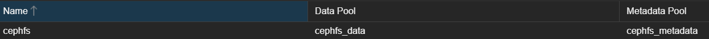

## データの対比

pve02には2つSSDが入っているのですが、片方をOSドライブ、片方をNFS Exportしてk8sのPVCとして使っています。
Cephが構築できればこのNFS Exportはいらないので、データをいったん退避してOSDにします。

```sh
cd /var
mkdir temp-0223
cd temp-0223
tar -cfvz "zfs-ssd.tar" /zfs-ssd-1
```

## Cephのインストール

### Setup

squid (19.2)が出ていたので使います。RepositoryはNo-Subscriptionにします。


以下のパッケージが入るようです。
```
  ceph ceph-base ceph-mds ceph-mgr ceph-mgr-modules-core ceph-mon ceph-osd
  ceph-volume cryptsetup-bin libnvme1 libparted2 libsqlite3-mod-ceph nvme-cli
  parted python3-autocommand python3-bcrypt python3-cffi-backend
  python3-cheroot python3-cherrypy3 python3-cryptography python3-inflect
  python3-jaraco.classes python3-jaraco.collections python3-jaraco.context
  python3-jaraco.functools python3-jaraco.text python3-logutils python3-mako
  python3-more-itertools python3-natsort python3-openssl python3-paste
  python3-pastedeploy python3-pastedeploy-tpl python3-pecan python3-portend
  python3-simplegeneric python3-singledispatch python3-tempita python3-tempora
  python3-waitress python3-webob python3-webtest python3-werkzeug
  python3-zc.lockfile sudo uuid-runtime
```

### ネットワークとレプリケーションの設定

NetworkとReplicationの設定を書きます。
Public/Cluster Networkは今回同じでいきます。

::: details Public NetworkとCluster Network
[wiki](https://pve.proxmox.com/wiki/Deploy_Hyper-Converged_Ceph_Cluster)から引用します。
- **Public Network**:
  This network will be used for public storage communication (e.g., for virtual machines using a Ceph RBD backed disk, or a CephFS mount), and communication between the different Ceph services. This setting is required.
  Separating your Ceph traffic from the Proxmox VE cluster communication (corosync), and possible the front-facing (public) networks of your virtual guests, is highly recommended. Otherwise, Ceph’s high-bandwidth IO-traffic could cause interference with other low-latency dependent services.
- **Cluster Network**:
  Specify to separate the OSD replication and heartbeat traffic as well. This setting is optional.
  Using a physically separated network is recommended, as it will relieve the Ceph public and the virtual guests network, while also providing a significant Ceph performance improvements.
  The Ceph cluster network can be configured and moved to another physically separated network at a later time.

PublicはCeph Service同士の通信とか、普通のRWに使われるっぽい？
ClusterはReplicationとHeartbeatに使われるみたいです。

CorosyncとPublicは分けたほうがいいでしょう。
:::

Replicationはデフォルトのままでいいでしょう。


### Success

完了したらこんな感じになります。


## Monitorを増やす

Ceph Monitorを増やします。
それぞれ別のノードで作ります。普通にインストールするとすでに1つだけあるはず。
3つ以上はいらないらしい。


## Managerも増やす

Monitorと同じようにManagerを増やします。
増やしたやつはStandbyになるはずです。


## OSDをつくる

OSDのメニューでCreate OSDからOSDを作ります。


## CephFSの作成

### MDS (MetaData Server)の作成

全ノードで作っておきます。


ここまでやるとクラスタのCeph/Servicesの項目がAll Greenになります。綺麗。


### CephFSの作成

左上のCreate CephFSから作れます。
値はデフォルトでいいと思います。

できてます。

CephFSをつくると、データとメタデータ用のPoolが自動で作られるようです。

ProxmoxのStorageとしても見えています。


### 試しにISOファイルを入れてみる

試しにUbuntu ServerのISOを入れてみましょう。
https://ftp.udx.icscoe.jp/Linux/ubuntu-releases/24.04.2/ から落とせる、`ubuntu-24.04.2-live-server-amd64.iso`を使います。


いい具合にReplicationされていそうです。


## VMを作れるようにする

### Poolの作成

RBD Poolを作成します。名前は適当に`vm`で。


### VMの作成

普通にVMを作りつつ、Disksの設定をします。
Storageに、作ったRBDを指定します。


## k8sから使えるようにする

[Rook](https://rook.io)を使って、ProxmoxのCephクラスタをk8sから見えるようにします。

幸いなことに、[External Storage Clusterについてのドキュメント](https://rook.io/docs/rook/latest-release/CRDs/Cluster/external-cluster/external-cluster/)
があるので、この通りにすれば良さそうです。

```shell
python3 create-external-cluster-resources.py --rbd-data-pool-name k8s --namespace rook-ceph --skip-monitoring-endpoint --format bash
```

出力をコピーしておきます。

#### HelmでOperatorをInstall

[`values-external`](https://github.com/rook/rook/blob/master/deploy/charts/rook-ceph-cluster/values-external.yaml)を用意します。

### 別の方法

Rookを使った方法も普通に動きます。
ただ、クラスタを破壊して再構築したときが少し面倒で、いちいちbackupからrestoreしてくる必要があります。
`nfs-subdir-external-provisioner`を使っていた時は、ファイル構造からPVの名前を排除していることで解決していましたが、
ブロックデバイスを使用する場合はもちろん、CephFSを使う場合でもそういったオプションはなさそうです。

というわけで、CephFSをNFS Exportして`nfs-subdir-external-provisioner`で使うことにします。
耐障害性は消えましたが、まあ自宅サーバ程度で困ることはそうないでしょう。ディスク障害でもデータは無事ですし。
もっと凝るなら、VIPでNFS Exportするとかやると良い感じに動くかもしれません。

ただこの方法、ローカルにデータがあってもいちいちNFSサーバまでデータを読みに行くので非効率です。
