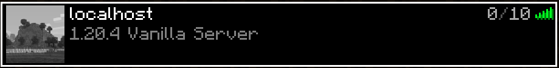

Rustとネットワークプログラミング両方勉強してみたかったので、
Rustで単純なTCPプロキシを作ってみる。
後々Minecraft Protocolを実装してソーリーサーバーとかヘルスチェックとかをしてみたいので、「Minecraftの」とつけた。

## まず動かすところまで

まずは使うパッケージを`Cargo.toml`に書いておく。

```toml [Cargo.toml]
[dependencies]
tokio = { version = "1.44.2", features = ["full"] }
anyhow = "1.0.98"
```

### 通信を受け付けてみる

```rust [main.rs]
#[tokio::main]
async fn main() -> anyhow::Result<()> {
    let bind_addr = "127.0.0.1:25565";
    let listener = TcpListener::bind(bind_addr).await?;

    loop {
        let (mut client, _) = listener.accept().await?;
        println!("Accepted connection");
    }
}
```

これを実行して、Minecraftとかnetcatとかで接続してみると、`Accepted connection`と表示される。

### プロキシにしてみる

サーバーに接続して、クライアントからの通信をそのまま流すようにしてみる。

```rust [main.rs]
#[tokio::main]
async fn main() -> anyhow::Result<()> {
    let bind_addr = "127.0.0.1:25565";
    let server_addr = "203.0.113.1:25565"; // ここは適当なアドレスに書き換えてください
    let listener = TcpListener::bind(bind_addr).await?;

    loop {
        let (mut client, _) = listener.accept().await?;
        println!("Accepted connection");
 // [!code ++]
        let mut upstream = match TcpStream::connect(server_addr).await { // [!code ++]
            Ok(upstream) => upstream, // [!code ++]
            Err(_) => { // [!code ++]
                eprintln!("Failed to connect to server"); // [!code ++]
                continue; // [!code ++]
            }, // [!code ++]
        }; // [!code ++]
 // [!code ++]
        tokio::io::copy_bidirectional(&mut client, &mut upstream).await?; // [!code ++]
    }
}
```

これを動かした後、サーバーアドレスの欄に`127.0.0.1`と入れると、`server_addr`で指定したサーバーに繋がる。



ログインして遊ぶことも可能なはず。

## `TcpListener::bind`は何をしているのか?

ここまでで一旦動くものができたので、`TcpListener::bind`が中で何をしているのかを掘っていく。
この段階で私が知っていたのは「なんかSocketてやつがあって通信してるんだよな～」くらいだったので、読者の想定レベルもそこに設定する。

TODO bindが中でbind, listen syscallをよんでいることとかをかく