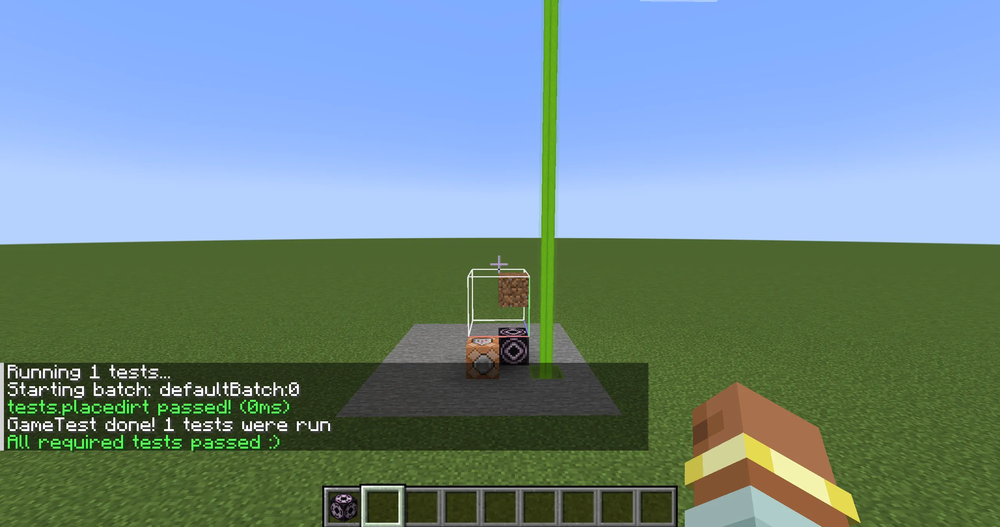
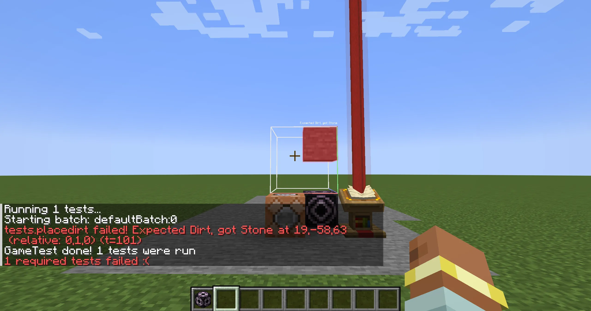
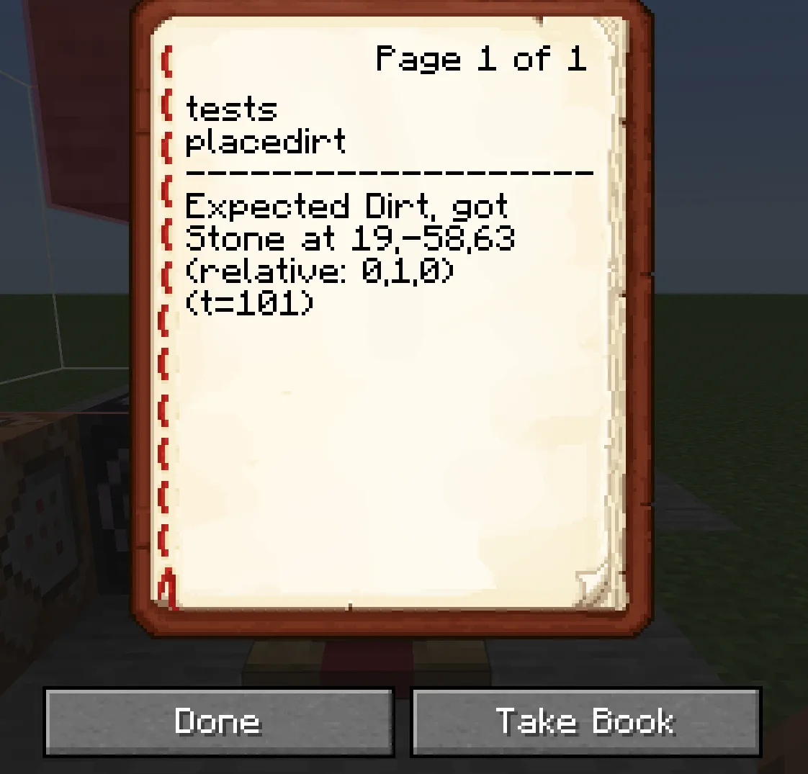

新しめのバージョンでは、[Game Tests](https://docs.neoforged.net/docs/misc/gametest/)の機能があり、Minecraftのワールドを使ってテストをすることができる。
とても欲しい機能なのだが、当然1.12.2にはない。なので移植を試みる。

今回の記事はbraindump的な側面を多分に含むので注意(保険)。

## Game Tests

Game Testsについて簡単に説明する。
その名の通り、実際のMinecraftのワールドを使ってModやデータパックのテストができる代物である。

例えば、以下のようなコードを書いて:
```java
@GameTestHolder(ExampleMod.MODID)
public class Tests {
    @GameTest
    public void placeDirt(GameTestHelper helper) {
        var pos = BlockPos.ZERO.above();
        helper.setBlock(pos, Blocks.DIRT);
        helper.succeedWhenBlockPresent(Blocks.DIRT, pos);
    }
}
```

ゲームを起動し、`/test runall`コマンドを実行してみる。
すると、`@GameTest`アノテーションがつけられている`placeDirt`メソッドが実行される。
`BlockPos.ZERO.above()`の位置に土ブロックが置かれ、置かれたブロックが土であることがAssertされる。



Fail時 の動作も見てみよう。
置くブロックをStoneにして、もう一度テストを実行してみる。
すると当然テストに失敗する。
エラーメッセージが出るのに加え、オーバーレイでも表示してくれるようだ。



Lecternにはエラーメッセージが格納されている。

<center>
    
</center>

## 方針

まずは必要な機能を大まかに考えてみる。

### テストクラス・メソッドの収集

`@GameTest`が付けられたメソッドを収集する何らかの方法が必要である。

Forgeはこれを2つの方法

- `@GameTestHolder`が付けられたクラスを収集して、そこから探す
- `RegisterGameTestsEvent`でModに登録してもらう

で行っている。

`@GameTestHolder`が付けられたクラスを収集するのは一見すると難しそうだが、JEIが`@JeiPlugin`が付けられたクラスを収集する部分を参考にすれば結構簡単に行けそうである。

### テストの実行

これは4段階くらいに分かれそう。

#### テストの下準備

空間の確保とレイアウトを行い、StructureBlockとCommandBlockを配置する。
また、設置したStructureBlockはNBTを流し込んで設定しておく。

#### テストの実行

StructureBlockをLoadして構造物を召喚、テストメソッドに書かれた内容を実行する。

#### 結果の評価

`GameTestHelper.succeed***`の内容が満たされるまで待つか、Timeoutする。

#### テストの後処理

エラーだったら、Lectern...はないのでチェストに本を入れたりなんやかんやしてエラーメッセージを通知する。

## 設計

大まかな設計を考える。

2つのデータクラス:
- `GameTestDefinition`
  - テストの名前、Structureの`ResouceLocation`、タイムアウト時間やテストそのものの関数`Consumer<IGameTestHelper>`を持つ。
- `GameTestExecutionContext`
  - テストを実行する`World`、`BlockPos`とかを持つ。
 
を定義し、
1. `GameTestCollector`みたいなクラスが`GameTestDefinition`を製造して`GameTestRegistry`に登録
2. `GameTestRunner`が`GameTestExecutionContext`と`GameTestDefinition`を受け取ってテストを実行する
 
みたいな感じにすればいけそう?
一番大変なのはテストの成功判定だろうか。

## 次回から

とりあえず、1つのテストだけでもを動かせる状態を目指して開発を進めていく。
できたら、良い感じのレイアウトとか非同期実行とかもやれたらいいな。

