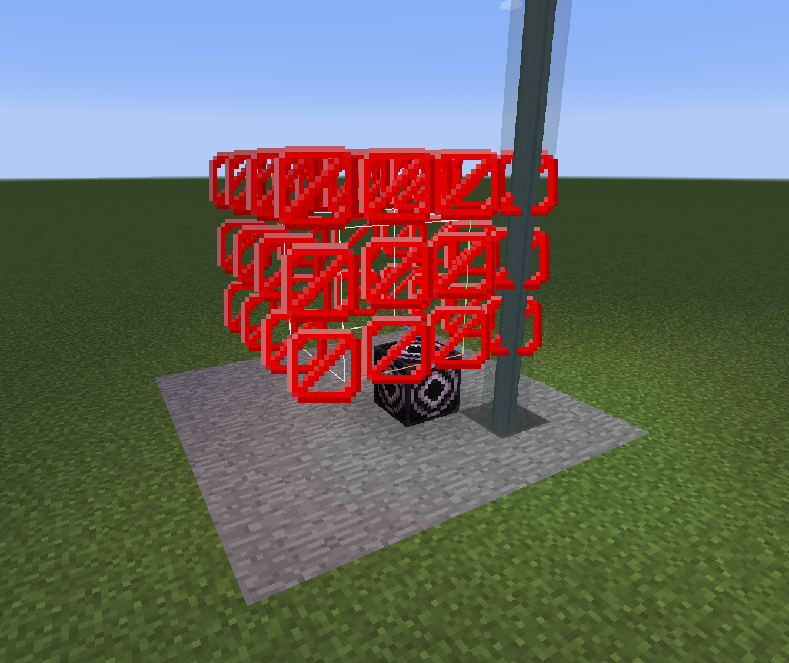

## 目次

[[toc]]

## シリーズ

- [Minecraft 1.12.2にGame Testsを移植したい - #0 構想編](../0604-mctest-0)
- [Minecraft 1.12.2にGame Testsを移植したい #1 - Method収集とStructureBlockの召喚](../0605-mctest-1)
- [Minecraft 1.12.2にGame Testsを移植したい #2 - テストの実行](../0608-mctest-2)

## 空間の確保と土台の設置

前回は、ただ足元にStructureBlockを召喚した。
今回は、まずその周りの一定範囲に空間を確保し、StructureBlockより低いy座標には、土台として石を設置してみよう。

まずは、テンプレートの大きさを取得する必要がある。
テンプレートは`TemplateManager.get`から取得できる。
`TemplateManager`は`World`から取得できるので、`GameTestCase`に`getTemplate`メソッドを生やす。

```kotlin
private fun getStructureTemplate(): Template? {
    val templateManager = context.world.structureTemplateManager
    val template = templateManager.get(context.world.minecraftServer, test.templateStructure)
    if (template == null) {
        context.sender.sendMessage(TextComponentString(
            "Structure ${test.templateStructure.toString()} not found."
        ))
    }
    return template
}
```

次に、テンプレートの大きさを受け取り空間を確保する関数を定義する。
また、テンプレート同士の間隔を定数にしておこう。

```kotlin
private const val HORIZONTAL_INTERVAL = 2
private const val VERTICAL_INTERVAL = 2
```

```kotlin
private fun clearSpace(templateSize: BlockPos) {
    val structureBlockPos = context.structureBlockPos
    val structureBlockY = structureBlockPos.y
    val pos1 = structureBlockPos.add(-HORIZONTAL_INTERVAL, -VERTICAL_INTERVAL, -HORIZONTAL_INTERVAL)
    val pos2 = structureBlockPos
        .add(templateSize).add(-1, -1, -1)
        .add(HORIZONTAL_INTERVAL, VERTICAL_INTERVAL, HORIZONTAL_INTERVAL)
    BlockPos.getAllInBox(pos1, pos2).forEach { pos ->
        val world = context.world
        if (pos.y < structureBlockY) {
            world.setBlockState(pos, Blocks.STONE.defaultState)
        } else {
            world.setBlockToAir(pos)
        }

    }
}
```

続いて、テンプレートの大きさを受け取り周りをバリアブロックで囲む関数を。

```kotlin
private fun encaseStructure(templateSize: BlockPos) {
    val structureBlockPos = context.structureBlockPos
    val pos1 = structureBlockPos.add(-1, 1, -1)
    val pos2 = structureBlockPos
        .add(templateSize).add(0, 1, 0)
    BlockPos.getAllInBox(pos1, pos2).forEach { pos ->
        val world = context.world
        val isEdge = (pos.x == pos1.x || pos.x == pos2.x)
                || (pos.z == pos1.z || pos.z == pos2.z)
        val isTop = pos.y == pos2.y
        if (isEdge || isTop) {
            world.setBlockState(pos, Blocks.BARRIER.defaultState)
        }
    }
}
```

さらにビーコンを設置する関数を定義する。

```kotlin
private fun spawnBeacon() {
    val glassPos = context.structureBlockPos.add(-1, -1, -1)
    val beaconPos = context.structureBlockPos.add(-1, -2, -1)
    val world = context.world
    world.setBlockState(glassPos, Blocks.STAINED_GLASS.getStateFromMeta(EnumDyeColor.GRAY.metadata))
    world.setBlockState(beaconPos, Blocks.BEACON.defaultState)
    BlockPos.getAllInBox(beaconPos.add(1, -1, 1), beaconPos.add(-1, -1, -1)).forEach { pos ->
        world.setBlockState(pos, Blocks.IRON_BLOCK.defaultState)
    }
}
```

これらの関数を`GameTestCase`の`prepare`で呼び出す。
また、`structureTile.load()`でテンプレートを読み込む。

```kotlin
fun prepare() {
    val template = getStructureTemplate()
    if (template == null) return
    clearSpace(template.size)
    encaseStructure(template.size)
    val pos = context.structureBlockPos
    val world: WorldServer = context.world
    spawnBeacon()
    world.setBlockState(pos, Blocks.STRUCTURE_BLOCK.defaultState)
    val structureTile = world.getTileEntity(pos)
    if (structureTile == null) {
        McTestLogger.error("Structure block at $pos is null, cannot prepare test ${test.testName}")
        return
    }
    if (structureTile !is TileEntityStructure) {
        McTestLogger.error("Tile entity at $pos is not a StructureBlockTileEntity, cannot prepare test ${test.testName}")
        return
    }
    structureTile.mode = TileEntityStructure.Mode.LOAD
    structureTile.name = test.templateStructure.toString()
    structureTile.load()
}
```

## StructureBlockの位置調整

今のままだと、プレイヤーの足元がStructureBlockの位置になる。
それは嫌なので、プレイヤーから少し離れた地面にStructureBlockを設置するようにしよう。

`GameTestExecutor.runAll`メソッドを修正する。

```kotlin
fun runAll(world: WorldServer, sender: ICommandSender) {
    val senderPos = sender.position
    val groundPos = BlockPos.getAllInBox(senderPos, senderPos.down(senderPos.y))
        .first { world.isAirBlock(it) }
    val pos = groundPos.add(3, 0, 3)
    GameTestRegistry.getAllTests().forEach { (name: String, definition: GameTestDefinition) ->
        val context = GameTestContext(world, pos, sender)
        val testCase = GameTestCase(context, definition)
        testCase.prepare()
        testCase.run()
    }
}
```

`BlockPos.getAllInBox(senderPos, senderPos.down(senderPos.y))`は小さい座標からIterateするので、`.first { world.isAirBlock(it) }`でプレイヤーの下にある「地面」の座標を取得できる。
そうして取得した座標から少しずらした位置をStructureBlockの位置にしている。

## 実行してみる

実行する前に、`mctest:tests_testexample`という名前のテンプレートをStructureBlockのSAVEモードで保存しておく。

`/mctest runall`コマンドを実行すると、石の土台とStructure周りのバリアブロック、さらにビーコンが設置される。

